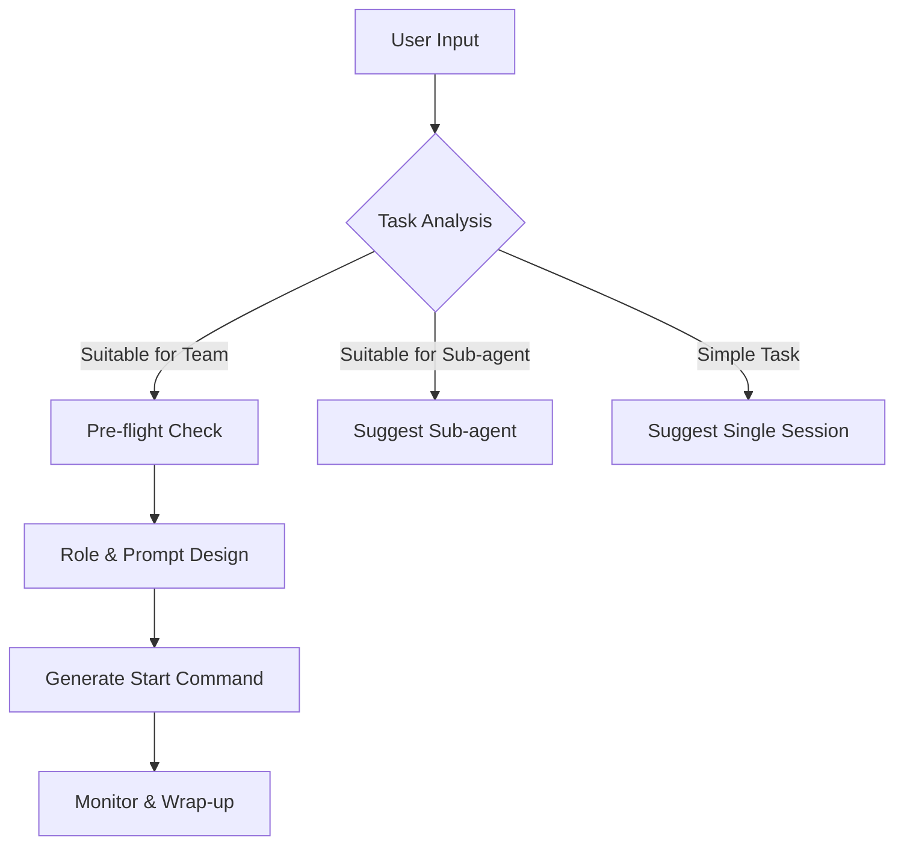

# Agent Teams Orchestrator

## Trigger Conditions

Activate when the user inputs:

- **Explicit commands**: "build team", "create team", "agent team", "parallel review"
- **Implicit needs**: "parallel processing", "multi-role collaboration", "comprehensive review", "brainstorming"
- **Complex scenarios**: Large-scale refactoring, cross-stack feature development, deep debugging of unknown root causes, technical solution comparison

## Core Workflow



## Step 1: Task Analysis & Decision

| Dimension         | Recommend Agent Teams           | Recommend Sub-agents             | Recommend Single Session  |
| :---------------- | :------------------------------ | :------------------------------- | :------------------------ |
| **Collaboration** | High (Debate/Review needed)     | Low (Independent parallel tasks) | None                      |
| **Complexity**    | Cross-domain (FE+BE+Sec)        | Repetitive (Generate 10 tests)   | Linear (A -> B -> C)      |
| **Context**       | Strong (Full project context)   | Weak (Specific files only)       | Strong                    |
| **Scenario**      | Architecture, Debugging, Review | Batch tests, Doc search          | Small features, Bug fixes |

## Step 2: Pre-flight Check

Before generating commands, **MUST** check/remind:

1.  **Environment Variable**: Must set `CLAUDE_CODE_EXPERIMENTAL_AGENT_TEAMS=1`
2.  **Display Mode**:
    - **Windows**: Default `in-process` (Best compatibility). Use `Shift+Up/Down` to switch teammates.
    - **Mac/Linux (with tmux)**: Recommend `tmux` split pane. Use `Ctrl+B` to switch panes.
3.  **Limitations**:
    - **No Session Resume**: `/resume` **does NOT** restore teammates. Save Review/Debug results to files immediately.
    - **Token Cost**: Each teammate is an independent session. Cost = Teammate Count × Task Volume.
    - **File Conflicts**: Ensure teammates edit different files or work sequentially.

## Step 3: Role Design Templates

Select the best template based on task type and **generate specific `Spawn` commands**. Roles are defined using **Engineering Best Practices**.

### Template A: Comprehensive Code Review

**Use Case**: PR Review, Security Audit, Performance Optimization
**Roles**:

1.  **Security Auditor**:
    - **Responsibility**: Audit code based on OWASP Top 10 standards.
    - **Focus**: SQL Injection, XSS, IDOR, Sensitive Data Exposure, Dependency Vulnerabilities.
2.  **Performance Engineer**:
    - **Responsibility**: Analyze time/space complexity and resource consumption.
    - **Focus**: N+1 Queries, Missing Indexes, Memory Leaks, I/O in Loops, Bundle Size.
3.  **Maintainability Expert**:
    - **Responsibility**: Ensure adherence to SOLID principles and team standards.
    - **Focus**: Naming Conventions, DRY, Decoupling, Error Handling Strategies, Readability.
4.  **QA Specialist**:
    - **Responsibility**: Verify test coverage and edge cases.
    - **Focus**: Unit Test Completeness, Boundary Conditions (Null/Empty/Max), Race Condition Risks.

### Template B: End-to-End Feature Development

**Use Case**: Full-stack Feature, Module Refactoring
**Roles**:

1.  **System Architect**:
    - **Responsibility**: Define system boundaries and data flow.
    - **Focus**: API Contracts (OpenAPI/GraphQL), Database Models, Service Communication, Error Propagation.
2.  **Frontend Specialist**:
    - **Responsibility**: Implement UI and interaction logic.
    - **Focus**: Component Reusability, State Management, Responsive Layout, A11y (WCAG), User Feedback (Loading/Error).
3.  **Backend Specialist**:
    - **Responsibility**: Implement core business logic and persistence.
    - **Focus**: Idempotency, Transaction Consistency, Data Validation, Authorization (AuthZ).
4.  **Test Engineer**:
    - **Responsibility**: Build the testing safety net concurrently.
    - **Focus**: Acceptance Criteria (AC) Verification, Integration Scenarios, Test Fixtures.

### Template C: Deep Debugging

**Use Case**: Hard-to-reproduce Bugs, System Crashes, Race Conditions
**Roles**:

1.  **Log Analyst**:
    - **Responsibility**: Reconstruct the scene from logs.
    - **Focus**: Trace ID Tracking, Timeline Reconstruction, Stack Trace Analysis, Pattern Recognition.
2.  **Code Auditor**:
    - **Responsibility**: Static analysis of code logic.
    - **Focus**: State Inconsistency, Unhandled Promises, Unreleased Resources, Lock/Deadlock Risks.
3.  **Reproduction Lead**:
    - **Responsibility**: Build minimal reproduction cases.
    - **Focus**: Variable Isolation, Environment Simulation, Automated Reproduction Scripts.

### Template D: Research & Spike

**Use Case**: Solution Comparison, Prototype Exploration
**Roles**:

1.  **Solution A Advocate**:
    - **Responsibility**: Deep dive into the potential of Solution A.
    - **Focus**: Best Practices Implementation, Performance Limits, Ecosystem Support, Success Stories.
2.  **Solution B Advocate**:
    - **Responsibility**: Deep dive into the potential of Solution B.
    - **Focus**: Same as above (as a competitor to A).
3.  **Decision Synthesizer**:
    - **Responsibility**: Produce an objective decision report.
    - **Focus**: Weighted Scoring Matrix, Long-term Maintenance Cost, Skill Gap Analysis, Migration Risk.

## Step 4: Runtime Guidance Examples

### Launch Command (Copy to Claude Code)

Do not just show the template, **generate executable Prompts directly**:

**Format Example**:

```markdown
# Launch [Task Type] Team

Please execute the following steps:

1. Ensure `export CLAUDE_CODE_EXPERIMENTAL_AGENT_TEAMS=1` is set.
2. Use the team mode managed by me (Lead).

Please create the following Teammates:

- **Spawn [Role A]**: "[Specific Prompt: Your goal is... Focus on... Output format...]"
- **Spawn [Role B]**: "[Specific Prompt: Your goal is... Focus on... Output format...]"
- ...

**Collaboration Rules**:

- Lead (Me) will assign initial tasks.
- Upon completion, use the `Ask` tool to notify me.
- [Role A] and [Role B] need to cross-check code during [Phase X].
```

### Control Cheatsheet

Include this cheatsheet in the analysis report:

| Action        | Command Example                    | Description                         |
| :------------ | :--------------------------------- | :---------------------------------- |
| **Create**    | `Spawn a researcher teammate...`   | Start a new teammate                |
| **Talk**      | `Ask the researcher to check...`   | Send message to teammate            |
| **Broadcast** | `Broadcast "Stop current task"...` | Send to everyone                    |
| **Wait**      | `Wait for teammates to finish`     | Block until tasks done (Important!) |
| **Cleanup**   | `Clean up the team`                | **MUST execute after task**         |

## Step 5: Execution Monitoring Checklist

Include this checklist in the output:

- [ ] **Env Var Check**: Is `CLAUDE_CODE_EXPERIMENTAL_AGENT_TEAMS=1` set?
- [ ] **File Lock**: Confirm teammates are not editing the same file concurrently.
- [ ] **Progress Sync**: Check teammate status every 10-15 mins (`Shift+Up/Down`).
- [ ] **Result Summary**: Before finishing, order the Lead to "Summarize all findings into report.md".
- [ ] **Resource Cleanup**: Confirm `Clean up the team` execution.

---

## Best Practices

1.  **Task Granularity**: Tasks shouldn't be too small (high coordination cost) or too large (loss of focus). Optimal granularity is "development of a standalone module" or "a specific verification experiment".
2.  **Explicit Context**: Define context clearly when spawning. Don't just say "Help me code".
    - _Bad_: "Spawn a dev."
    - _Good_: "Spawn a frontend dev to implement the login page using React and Tailwind, matching the design in details.md."
3.  **Use Wait**: After assigning tasks, use `Wait for teammates to finish` to pause the Lead, preventing hallucinations or premature completion while teammates work.

## Output Example

> **Analysis Result**: Detected intent for parallel code review.
>
> **Recommend**: Agent Teams (Code Review Template)
> **Reason**: Involves Security, Performance, and Logic aspects; parallel review offers highest efficiency.
>
> ---
>
> **Execution Steps**:
>
> 1.  Ensure environment variable is set (PowerShell):
>     `$env:CLAUDE_CODE_EXPERIMENTAL_AGENT_TEAMS="1"`
> 2.  **Copy the following command to launch the team**:
>     ```text
>     Create an agent team for code review.
>     Spawn a security_expert to "Review src/auth for vulnerabilities, focusing on JWT handling and SQL injection."
>     Spawn a performance_expert to "Analyze database queries in src/api for N+1 problems and missing indexes."
>     Spawn a test_expert to "Check if all new logic in the PR has corresponding unit tests."
>     Tell them to report their findings to me when done.
>     Wait for teammates to finish.
>     ```
> 3.  **Monitor**: Use `Shift+Up` / `Shift+Down` to switch views.
> 4.  **Wrap-up**: After review, input `Clean up the team`.
